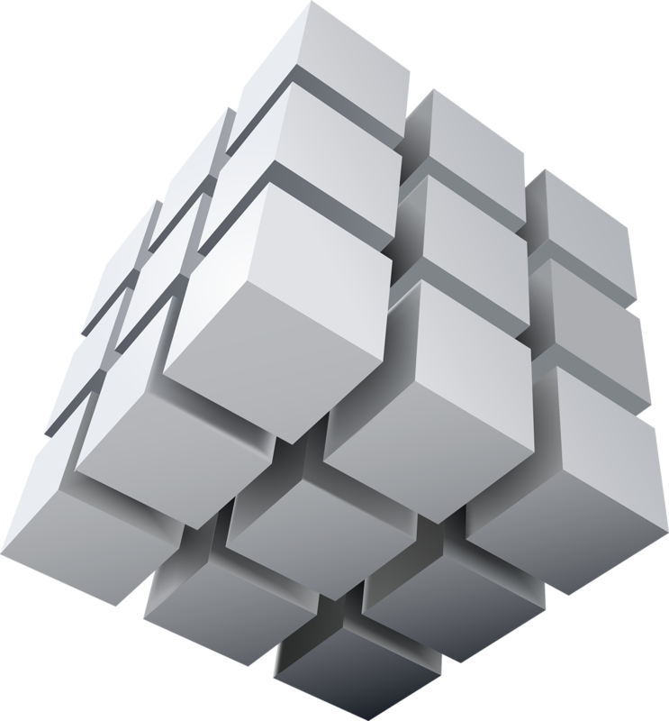

     

<h1 align="center" width="100%">HYPERCUBE</h1>

    PROJECT METACUBE: <a href="https://github.com/MetaTHC/metacube">PRIVATE REPO</a> 
    PROJECT BLOG: <a href="https://blog.metacubic.org">OUR BLOG</a> 
    PROJECT WHITEPAPER: <a href="https://metacubic.org/whitepaper">WHITEPAPER [NOT YET RELEASED]</a>

###### Phase 2:
We currently have a fully working **'BLOCKCHAIN'**, this has been built using [JavaScript]() & [TypeScript]() and currently mines, through
actions of the user (API BASED). We are currently working on the implementation of our 'UM³' Blocks, which help form the **CUBE**.

##### What is 'UM³'?
UM³ is a User Module that is created when a user signs up to the platform. This module is then used to create a **'BLOCK'** that is
then added to the **'BLOCKCHAIN'**. This is the first step in creating the **'CUBE'**. UM³ is also a single coin, with 13 Billion in reserve for the populous.

More details coming soon...
